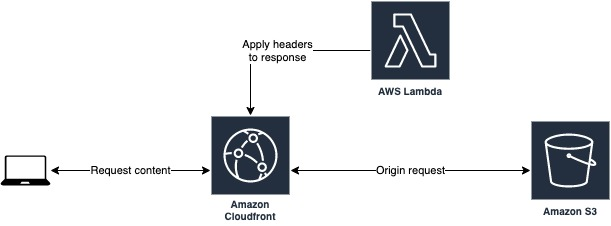

# HTTP Secure Headers

## Description

This service is a Node+Typescript+SAM based Lambda that adds security related HTTP headers to the responses.
It is meant to be consumed as a Lambda@Edge that is triggered by a Cloudfront viewer response event.



## Security Headers

Applied security headers

- [Strict-Transport-Security](https://developer.mozilla.org/en-US/docs/Web/HTTP/Headers/Strict-Transport-Security): max-age=63072000; includeSubdomains
- [X-Content-Type-Options](https://infosec.mozilla.org/guidelines/web_security#x-content-type-options): nosniff
- [X-Frame-Options](https://infosec.mozilla.org/guidelines/web_security#x-frame-options): SAMEORIGIN
- [X-XSS-Protection](https://infosec.mozilla.org/guidelines/web_security#x-xss-protection): mode=block
- [Referrer-Policy](https://infosec.mozilla.org/guidelines/web_security#referrer-policy): same-origin
- [Content-Security-Policy](https://infosec.mozilla.org/guidelines/web_security#content-security-policy): default-src 'self'

[CSP sources documentation](https://content-security-policy.com/#source_list)

## Snapshot tests

Tests utilize Jest Snapshots.
Run tests locally in watch mode:

```
  npm t
```

## Requirements

- [NPM](https://www.npmjs.com/)
- [Serverless Application Model](https://docs.aws.amazon.com/serverless-application-model/latest/developerguide/serverless-sam-cli-install.html)

## Build & deploy

Create bucket

```
  aws s3api create-bucket --bucket DEPLOYMENT_BUCKET --region us-east-1
```

Deploy lambda

```
  npm run build
  sam deploy -t http-secure-headers.yaml \
      --stack-name STACK_NAME \
      --s3-bucket DEPLOYMENT_BUCKET \
      --capabilities CAPABILITY_IAM \
      --parameter-overrides app=APP_NAME stage=STAGE \
      --region us-east-1 \
      --no-fail-on-empty-changeset
```
